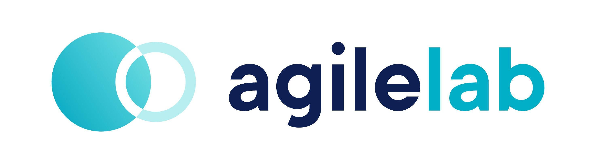

<p align="center">
    <a href="https://www.witboost.com/">
        
    </a>
</p>

Designed by [Agile Lab](https://www.agilelab.it/), witboost is a versatile platform that addresses a wide range of sophisticated data engineering challenges. It enables businesses to discover, enhance, and productize their data, fostering the creation of automated data platforms that adhere to the highest standards of data governance. Want to know more about witboost? Check it out [here](https://www.witboost.com/) or [contact us!](https://witboost.com/contact-us)

This repository is part of our [Starter Kit](https://github.com/agile-lab-dev/witboost-starter-kit) meant to showcase witboost's integration capabilities and provide a "batteries-included" product.

# Snowflake Specific Provisioner

- [Overview](#overview)
- [Building](#building)
- [Running](#running)
- [Configuring](#configuring)
  - [Account Setup](#account-setup)
  - [Principal Mapping](#principals-mapper)
  - [Reverse Provisioning](#reverse-provisioning)
- [Deploying](#deploying)
- [HLD](docs/HLD.md)
- [API specification](docs/API.md)

## Overview

This project implements a simple Specific Provisioner for Snowflake. After deploying this microservice and configuring witboost to use it, the platform can deploy components of a Data Product that use Snowflake. Supported components are: Output Port, Storage Area.

Refer to the [witboost Starter Kit repository](https://github.com/agile-lab-dev/witboost-starter-kit) for information on the templates that can be used with this Specific Provisioner.

### What's a Specific Provisioner?

A Specific Provisioner is a microservice which is in charge of deploying components that use a specific technology. When the deployment of a Data Product is triggered, the platform generates it descriptor and orchestrates the deployment of every component contained in the Data Product. For every such component the platform knows which Specific Provisioner is responsible for its deployment, and can thus send a provisioning request with the descriptor to it so that the Specific Provisioner can perform whatever operation is required to fulfill this request and report back the outcome to the platform.

You can learn more about how the Specific Provisioners fit in the broader picture [here](https://docs.witboost.agilelab.it/docs/p2_arch/p1_intro/#deploy-flow).

### Snowflake

Snowflake is a cloud-based data warehousing platform that provides scalable storage, easy data sharing, and on-demand, near-infinite computing power for processing complex, analytical queries on structured and semi-structured data. It separates compute and storage resources, allowing users to scale and pay for each independently, maximizing efficiency and cost-effectiveness. Learn more about it on the [official website](https://www.snowflake.com/en/).

### Software stack

This microservice is written in Scala 2.13, using Akka HTTP (pre-license change) for the HTTP layer. Communication with Snowflake is handled via the official JDBC driver. Project is built with SBT and supports packaging as JAR, fat-JAR and Docker image, ideal for Kubernetes deployments (which is the preferred option).

## Building

**Requirements:**

- Java 17 (11 works as well)
- SBT
- Node
- Docker (for building images only)

**Generating sources:** this project uses OpenAPI as standard API specification and the [OpenAPI Generator](https://openapi-generator.tech) CLI to generate server code from the specification.

In a terminal, install the OpenAPI Generator CLI and run the `generateCode` SBT task:

```bash
npm install @openapitools/openapi-generator-cli -g
sbt generateCode
```

*Note:* the `generateCode` SBT task needs to be run again if `clean` or similar tasks are executed.

**Compiling:** is handled by the standard task:

```bash
sbt compile
```

**Tests:** are handled by the standard task as well:

```bash
sbt test
```

**Artifacts & Docker image:** the project uses SBT Native Packager for packaging. Build artifacts with:

```
sbt package
```

The Docker image can be built with:

```
sbt docker:publishLocal
```

*Note:* the version for the project is automatically computed using information gathered from Git, using branch name and tags. Unless you are on a release branch `1.2.x` or a tag `v1.2.3` it will end up being `0.0.0`. You can follow this branch/tag convention or update the version computation to match your preferred strategy.

**CI/CD:** the pipeline is based on GitLab CI as that's what we use internally. It's configured by the `.gitlab-ci.yaml` file in the root of the repository. You can use that as a starting point for your customizations.

## Running

To run the server locally, use:

```bash
sbt generateCode compile run
```

By default, the server binds to port 8093 on localhost. After it's up and running you can make provisioning requests to this address. You can also check the API documentation served [here](http://127.0.0.1:8093/swagger/docs/index.html).

## Configuring

Most application configurations are handled with the Typesafe Config library. You can find the default settings in the `reference.conf` and some `application.conf` examples in the Helm chart (see below). Customize them and use the `config.file` system property or the other options provided by Typesafe Config according to your needs.

Snowflake connection information can be passed in via environment variables or configuration file; the mapping done by default resides in the `reference.conf` and is the following:

| Setting                       | Environment Variable          |
|-------------------------------|-------------------------------|
| snowflake.user                | SNOWFLAKE_USER                |
| snowflake.password            | SNOWFLAKE_PASSWORD            |
| snowflake.role                | SNOWFLAKE_ROLE                |
| snowflake.account             | SNOWFLAKE_ACCOUNT             |
| snowflake.warehouse           | SNOWFLAKE_WAREHOUSE           |
| snowflake.jdbc-url            | JDBC_URL                      |
| snowflake.account-locator-url | SNOWFLAKE_ACCOUNT_LOCATOR_URL |

To clarify, below a detailed explain of how configure your variables. By accessing your Snowflake environment, in the lower left part of the page, you can retrieve these information:

<p align="center">
    <a href="https://www.witboost.com/">
        
    </a>
</p>

Based on this, you are able to configure your variables simply following the placeholders in the previous image. The only exception is for these two:

- **JDBC_URL**: is a string composed in this way *jdbc:snowflake://**[ORGANIZATION]-[ACCOUNT NAME]**.snowflakecomputing.com*. Following the placeholders you can easily create your jdbc string
- **SNOWFLAKE_ACCOUNT_LOCATOR_URL**: you can retrieve this from the specific button, highlighted in green in the image

Logging is handled with Logback, you can find an example `logback.xml` in the Helm chart. Customize it and pass it using the `logback.configurationFile` system property.

### Account Setup

It's possible to run this microservice with a different role than the administrator user.

> **NOTE:** For the tag support feature, if you want to use a **custom role** pay attention on the next dedicated paragraph, because others settings are needed.

In other words, to use a custom role it's important to have a Snowflake user with these types of permissions:

- create role on the account
- manage grants on the account
- create a database on the account
- usage on the warehouse

You can easily set up your own dedicated Snowflake user by following a few specific instructions.

For example, you could create a custom role **'WITBOOST'** through which add needed privileges to an existing account or to a new one. Below the commands that must be executed:

```sql
CREATE ROLE WITBOOST; 
GRANT CREATE ROLE ON ACCOUNT TO ROLE WITBOOST;
GRANT MANAGE GRANTS ON ACCOUNT TO ROLE WITBOOST;
GRANT CREATE DATABASE ON ACCOUNT TO ROLE WITBOOST;
GRANT USAGE ON WAREHOUSE <YOUR_WAREHOUSE> TO ROLE WITBOOST;
GRANT ROLE WITBOOST TO USER WITBOOST;
```

In this way, you will create a Snowflake role **'WITBOOST'** and you will associate it to an existing user **'WITBOOST'**. After this setup, you will be able to use this user and role to perform actions by the provisioner.

#### Tag feature setup

The Snowflake provisioner is also able to create and remove tags from columns and components.

Assuming this feature access on the *SNOWFLAKE.ACCOUNT_USAGE* schema, it's possible to use a custom role, but some previous actions are needed.

These actions are **mandatory** if you use a **custom role**, because it cannot directly access on that schema.

These the steps that must be executed:

```sql
CREATE DATABASE IF NOT EXISTS WITBOOST;
CREATE SCHEMA IF NOT EXISTS WITBOOST.CONFIGURATIONS; 
CREATE VIEW IF NOT EXISTS WITBOOST.CONFIGURATIONS.TAG_REFERENCES AS SELECT * FROM SNOWFLAKE.ACCOUNT_USAGE.TAG_REFERENCES; 
GRANT USAGE ON DATABASE WITBOOST TO ROLE WITBOOST; 
GRANT USAGE ON SCHEMA WITBOOST.CONFIGURATIONS TO ROLE WITBOOST; 
GRANT SELECT ON VIEW WITBOOST.CONFIGURATIONS.TAG_REFERENCES TO ROLE WITBOOST;
```

In case you want to use a different database, schema or view, you are free to modify the previous commands with others value. Remember only to configure also these settings:


| Setting                           | Environment Variable              | Default value  |
|-----------------------------------|-----------------------------------|----------------|
| snowflake.tag-references.database | SNOWFLAKE_TAG_REFERENCES_DATABASE | WITBOOST       |
| snowflake.tag-references.schema   | SNOWFLAKE_TAG_REFERENCES_SCHEMA   | CONFIGURATIONS |
| snowflake.tag-references.view     | SNOWFLAKE_TAG_REFERENCES_VIEW     | TAG_REFERENCES |


### Principals Mapper

When the `updateAcl` is queried, it requires a list of identities as parameter. This is the list of users/groups/roles that need the access.
These identities have a meaning in the Witboost context, but might not have sense in the context of your resources (see Snowflake).

For this reason, we had introduced the concept of `PrincipalsMapper` strategy, which converts the identities from the Witboost context to the one that Snowflake uses.

#### Identity Mapper Strategy

---

In this strategy, the input is returned as output without any transformation.

| Setting                              | Environment Variable                 | Default value | Allowed values       |
|--------------------------------------|--------------------------------------|---------------|----------------------|
| snowflake.principals-mapper.strategy | SNOWFLAKE_PRINCIPALS_MAPPER_STRATEGY | identity      | identity,table-based |

The default configuration uses an `identity` mapping strategy.

#### Table Based Mapper Strategy

---

It is possible to use a `table-based` mapping if, for example, Snowflake is not configured to use SSO. In this case the mapping table is used and is expected to be already present and filled with all the required mapping entries.

The following options allow you to customize the database, schema and name of the mapping table:

| Setting                                          | Environment Variable                             | Default value      |
|--------------------------------------------------|--------------------------------------------------|--------------------|
| snowflake.principals-mapper.table-based.database | SNOWFLAKE_PRINCIPALS_MAPPER_TABLE_BASED_DATABASE | WITBOOST           |
| snowflake.principals-mapper.table-based.schema   | SNOWFLAKE_PRINCIPALS_MAPPER_TABLE_BASED_SCHEMA   | CONFIGURATIONS     |
| snowflake.principals-mapper.table-based.table    | SNOWFLAKE_PRINCIPALS_MAPPER_TABLE_BASED_TABLE    | PRINCIPALS_MAPPING |

You can find a sample SQL script to create required objects [here](docs/create_mapping_table.sql). Update it before executing, if you decide to use different default values for database, schema or table name.

The role used  by the provisioner must have `SELECT` privileges on this table.

### Reverse Provisioning

This Specific Provisioner support the Reverse Provisioning operation, used on Witboost to import or update existing resources onto the platform. The Snowflake Specific Provisioner supports reverse provisioning for both output ports and storage area components. Specifically, it supports:

* Reverse provisioning of a list of tables (modifying the `spec.mesh.specific.tables` catalog-info field, containing table name and column metadata) for storage area components given the input:
    ```json
    {
      "database": "databaseName",
      "schema": "schemaName",
      "tables": ["listOf", "tableNames"]
    }
    ```
* Reverse provisioning for output port components, including data contract schema (modifying `spec.mesh.dataContract.schema`) and table/view tags (`spec.mesh.tags`) given the input:
    ```json
    {
      "database": "databaseName",
      "schema": "schemaName",
      "viewName": "viewName"
    }
    ```
    > Currently, reverse provisioning doesn't support importing column tags on the data contract schema

The Specific Provisioner identifies the type of component to be imported based on the useCaseTemplateId sent as part of the request. For this purpose, two configuration fields are added to the Specific Provisioner configuration file to specify the expected useCaseTemplateIds:

| Setting                                           | Default value                                   |
|---------------------------------------------------|-------------------------------------------------|
| specific-provisioner.storage-useCaseTemplateId    | urn:dmb:utm:snowflake-storage-template:0.0.0    |
| specific-provisioner.outputport-useCaseTemplateId | urn:dmb:utm:snowflake-outputport-template:0.0.0 |

Set these values based on the useCaseTemplateId used by your components.

## Deploying

This microservice is meant to be deployed to a Kubernetes cluster with the included Helm chart and the scripts that can be found in the `k8s` subdirectory.

## License

This project is available under the [Apache License, Version 2.0](https://opensource.org/licenses/Apache-2.0); see [LICENSE](LICENSE) for full details.

## About us

<p align="center">
    <a href="https://www.agilelab.it">
        
    </a>
</p>

Agile Lab creates value for its Clients in data-intensive environments through customizable solutions to establish performance driven processes, sustainable architectures, and automated platforms driven by data governance best practices.

Since 2014 we have implemented 100+ successful Elite Data Engineering initiatives and used that experience to create Witboost: a technology-agnostic, modular platform, that empowers modern enterprises to discover, elevate and productize their data both in traditional environments and on fully compliant Data mesh architectures.

[Contact us](https://www.agilelab.it/contacts) or follow us on:
- [LinkedIn](https://www.linkedin.com/company/agile-lab/)
- [Instagram](https://www.instagram.com/agilelab_official/)
- [YouTube](https://www.youtube.com/channel/UCTWdhr7_4JmZIpZFhMdLzAA)
- [Twitter](https://twitter.com/agile__lab)


