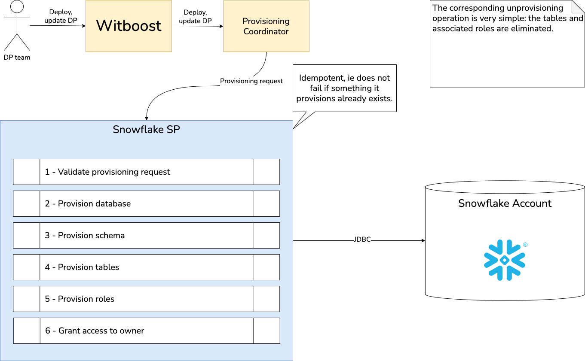
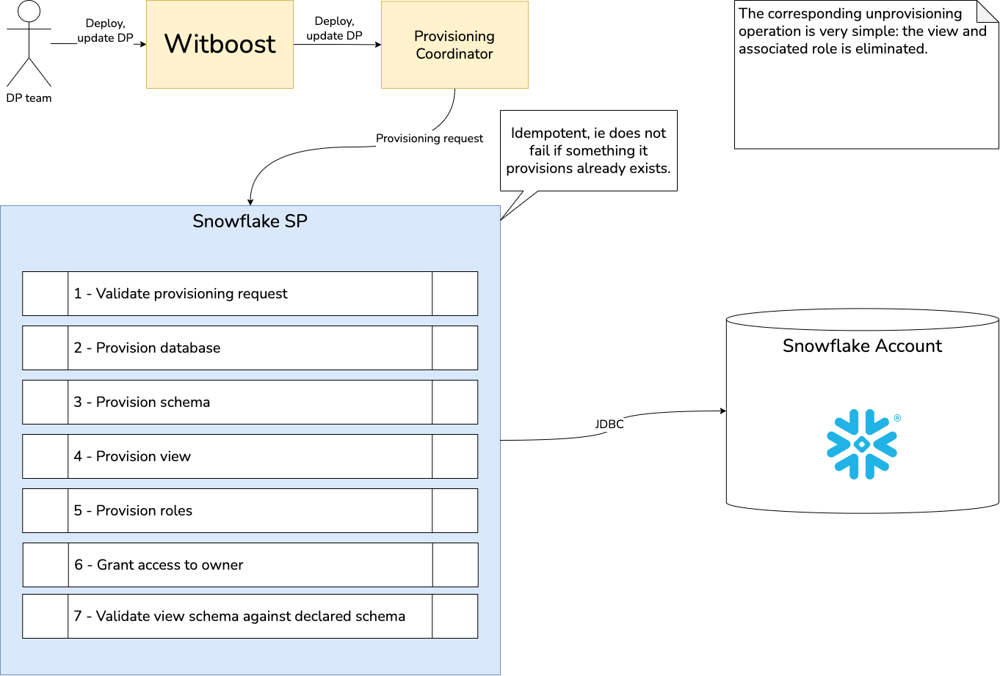

# High Level Design

This document describes the High Level Design of the Snowflake Specific Provisioner.
The source diagrams can be found and edited in the [accompanying draw.io file](hld.drawio).

## Overview

### Specific Provisioner
A Specific Provisioner (SP) is a service in charge of performing a resource allocation task, usually
through a Cloud Provider. The resources to allocate are typically referred to as the _Component_, the
details of which are described in a YAML file, known as _Component Descriptor_.

The SP is invoked by an upstream service of the Witboost platform, namely the Coordinator, which is in charge of orchestrating the creation
of a complex infrastructure by coordinating several SPs in a single workflow. The SP receives
the _Data Product Descriptor_ as input with all the components (because it might need more context) plus the id of the component to provision, named _componentIdToProvision_

To enable the above orchestration a SP exposes an API made up of five main operations:
- validate: checks if the provided component descriptor is valid and reports any errors
- provision: performs the resource allocation specified by the descriptor previously validated
- status: returns the status of the provisioning process, an identifier of which is provided as input
- unprovision: destroys the resources previously allocated.
- updateacl: grants access to a specific component/resource to a list of users/groups

### Snowflake Specific Provisioner

This Specific Provisioner interacts with a Snowflake Account using the official JDBC drivers and is able to provision Storage Areas as well as Output Ports based on them.

## Storage Area

A Storage Area is a collection of tables inside a schema inside a database. Provisioning of the database and schema is done automatically if they are not already present. Tables are created according to the schema information in the descriptor.

## Output Ports

Output Ports are implemented as views on top of tables form a Storage Area. The views are created according to the schema information in the descriptor.

### ACL management

The permissions/ACL management is what materializes the permissions that are granted via the access request flow. The flow starts when a user requests access to an Output Port of a Data Product published in the marketplace. If the request is accepted by the Data Product owner, the Specific provisioner is instructed to update the permissions. Permission management uses Snowflake's grant system to allow view/table level access to the data based on the user's identity, excluding groups as these are not supported by Snowflake.